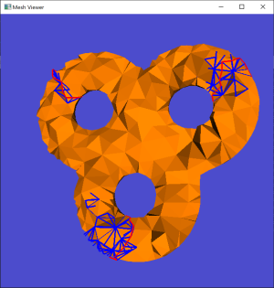

# Harmonic Map

This C++ project framework is used to help students to implement handle and tunnel loops algorithm. It contains a simple opengl viewer.

## Dependencies
 
1. `DartLib`, a 2d/3d-mesh library based on dart data structure.
2. `freeglut`, a free-software/open-source alternative to the OpenGL Utility Toolkit (GLUT) library.

## Directory Structure

``` txt
include          -- The header files of the algorithm.
src              -- The source files of the algorithm. 
CMakeLists.txt   -- CMake configuration file.
```

## Configuration

### Windows

1. Install [CMake](https://cmake.org/download/).

2. Download the source code of the C++ framework.
> E.x. I create a folder `projects` in `C:/`, then unzip the source code there.

3. Configure and generate the project for Visual Studio.

> ``` bash
> cd CCGHomework
> mkdir build
> cd build
> cmake ..
> ```
> *One can also finish this step using CMake GUI.*

4. Open the \*.sln using Visual Studio, and complie the solution.

5. Finish your code in your IDE.

6. Run the executable program.
> E.x. 
> ``` bash
> cd bin
> ./HandleTunnelLoop.exe ../data/genus3_I.m ../data/genus3_I_surface.m
> ./HandleTunnelLoop.exe ../data/genus3_O.m ../data/genus3_O_surface.m
> ```

7. Press '?' when your mouse is focused on the glut window, and follow the instruction in the command line window.
> If you can see the following results, then it means that you have finished the harmonic map algorithm. 
> 
>  

### Linux & Mac

1. Build and compile the code.

> ``` bash
> cd CCGHomework
> mkdir build
> cd build
> cmake ..
> make && make install
> ```

2. Run the executable program.

> ``` bash
> cd ../bin/
> ./HandleTunnelLoop ../data/genus3_I.m ../data/genus3_I_surface.m
> ./HandleTunnelLoop ../data/genus3_O.m ../data/genus3_O_surface.m
> ```
